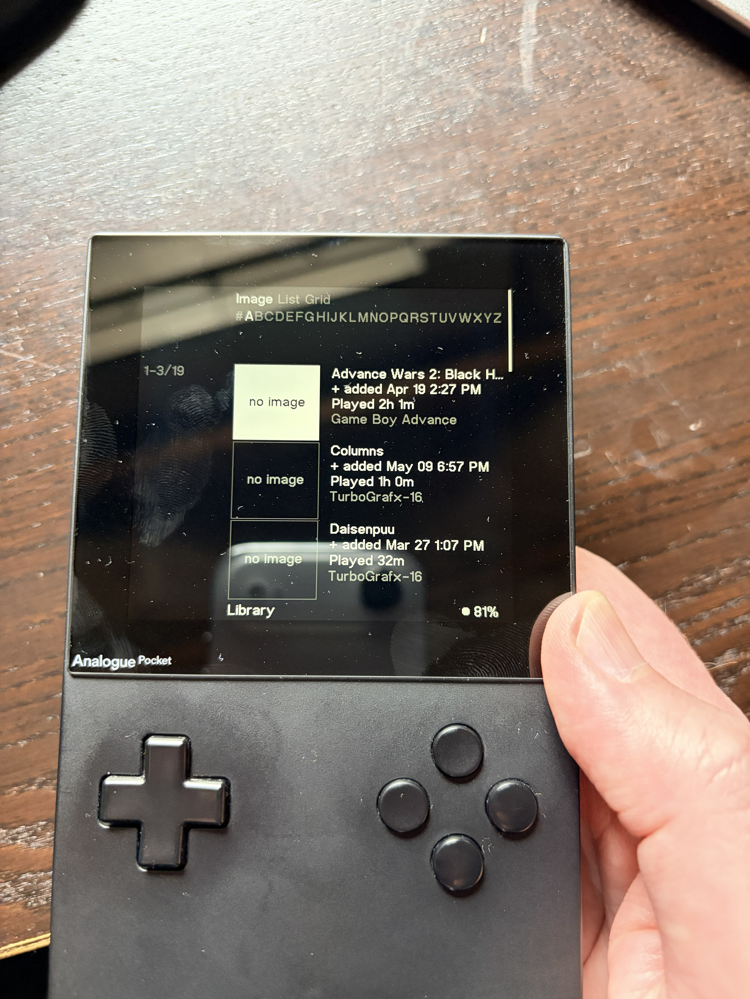
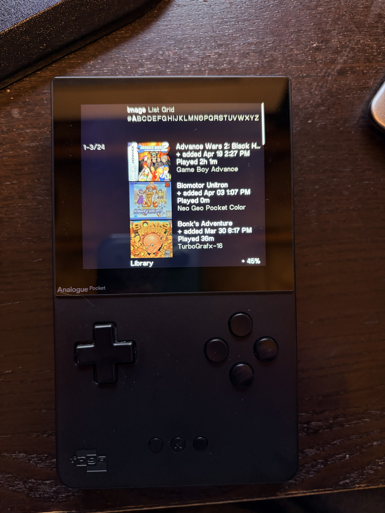

# Analogue Library Image Generator

Missing game images on your Analogue Pocket or Duo?

Transform this:


To this:


Populates the **Library** view on the Analogue Pocket and Analogue Duo with box art fetched from [libretro-thumbnails](https://github.com/libretro-thumbnails/libretro-thumbnails).

Inspired by and borrowed from [codewario](https://github.com/codewario/PocketLibraryImages)

## Supported Devices & Consoles

| Console | `--console` | Pocket | Duo |
|---------|-------------|--------|-----|
| PC Engine / TurboGrafx-16 | `pce` | ✅ confirmed | ✅ confirmed |
| PC Engine CD / TurboGrafx-CD | `pcecd` | — | ✅ confirmed |
| Game Boy Advance | `gba` | ✅ confirmed | — |
| Neo Geo Pocket Color | `ngp` | ✅ confirmed | — |

---

## Setup

**Requires Python 3.9+.** Download from [python.org](https://www.python.org/downloads/) and ensure it is on your PATH.

```bash
# 1. Create and activate a virtual environment (keeps dependencies isolated)
python -m venv .venv

# macOS / Linux
source .venv/bin/activate

# Windows
.venv\Scripts\activate

# 2. Install dependencies
pip install -r requirements.txt
```

You only need to do this once. Re-activate the venv (`source .venv/bin/activate` or `.venv\Scripts\activate`) each time you open a new terminal.

---

## Usage

Mount your Analogue SD card and run:

```bash
# Pocket — generate images for all games you've played
python analogue_image_gen.py "/Volumes/Pocket" --console pce

# Duo — generate images for all games you've played
python analogue_image_gen.py "/Volumes/Duo" --console all
```

```powershell
# Windows example
python analogue_image_gen.py "E:\" --console pce
```

Use `convert-only` to skip re-downloading images already in the local cache.

### What it does

1. **Downloads** the full libretro-thumbnails archive for the selected console and caches it locally (`~/.analogue-image-gen/cache/`)
2. **Reads** your played-games list from `System/Played Games/list.bin` on the SD card — only games you've actually launched get images
3. **Matches** each game by name to a libretro thumbnail using fuzzy matching
4. **Converts** the matched image to Analogue's `.bin` format and writes it to `System/Library/Images/<console>/` on the SD card, named after the game's CRC32

The script is **idempotent**: re-running it skips files that already exist. Use `--force` to overwrite everything.

### Assumptions

- The SD card is mounted and writable
- The device has been used to launch at least one game (so `list.bin` exists and has entries)
- Box art is sourced from libretro-thumbnails — if a game has no entry there, no image will be generated
- Romhacks, pirate releases, and Virtual Console titles are skipped by default

### Options

| Flag | Default | Description |
|------|---------|-------------|
| `--console` | required | Console to process: `pce`, `pcecd`, `gba`, `ngp`, or `all` |
| `--force` | off | Overwrite images that already exist on the SD card |
| `--include-roms` | off | Also generate images for downloaded ROMs, not just physical carts |
| `--image-type` | `boxart` | Image source: `boxart`, `title`, or `snap` |
| `--device` | auto-detected | `pocket` or `duo` (auto-detected from SD card root) |

---

## Troubleshooting

**A game is missing its image**
The name in `list.bin` didn't match any libretro-thumbnails filename. Check the output — unmatched games are listed with a `·` marker. You can add a redirect in `special_cases.json` to map the name manually.

**Download timed out**
GitHub archive downloads can take 20+ minutes for large repos. If it times out, run with `convert-only` to use what's already cached, or follow [`create-local-archive.md`](./create-local-archive.md) to create a local archive.

**Images don't appear after running the script**
Confirm the files are in the correct directory (`System/Library/Images/pce/` not `System/Library/Images/PC Engine/`). The directory name must match the core's `platform_ids` value exactly.
